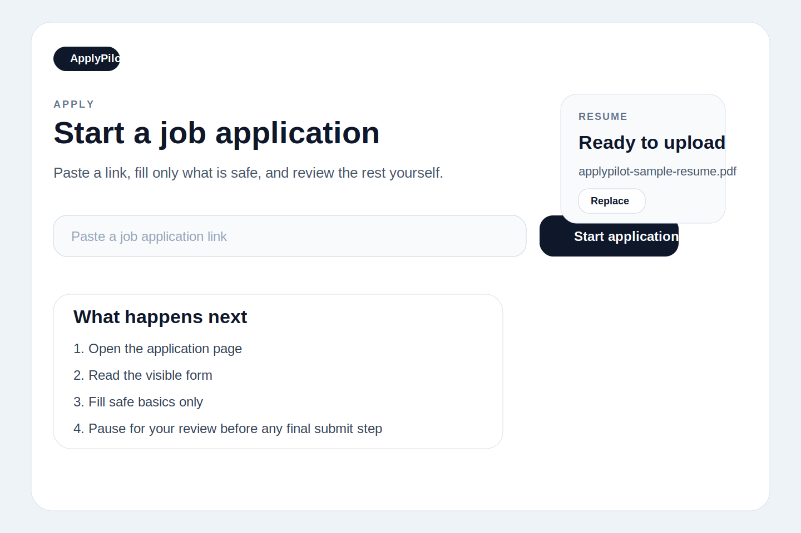
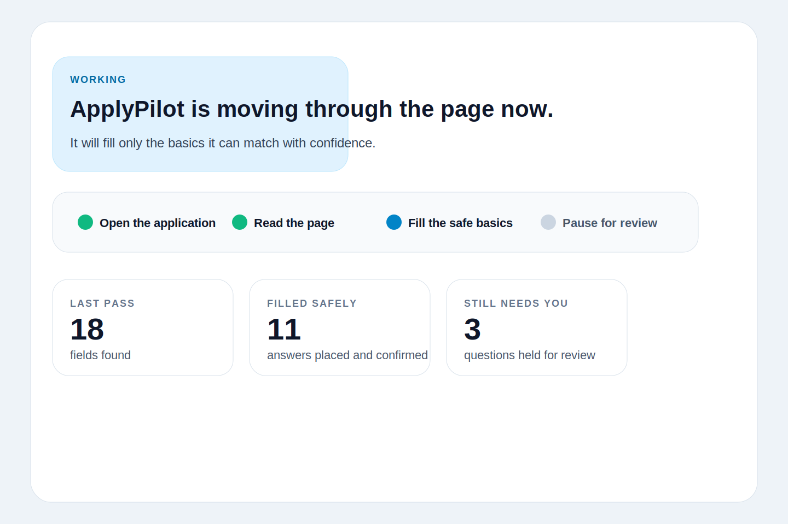
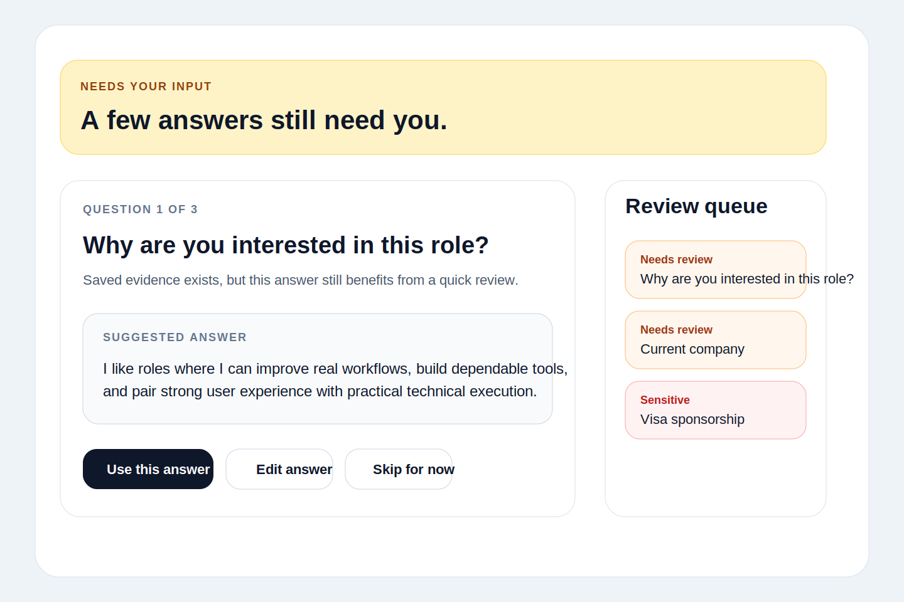
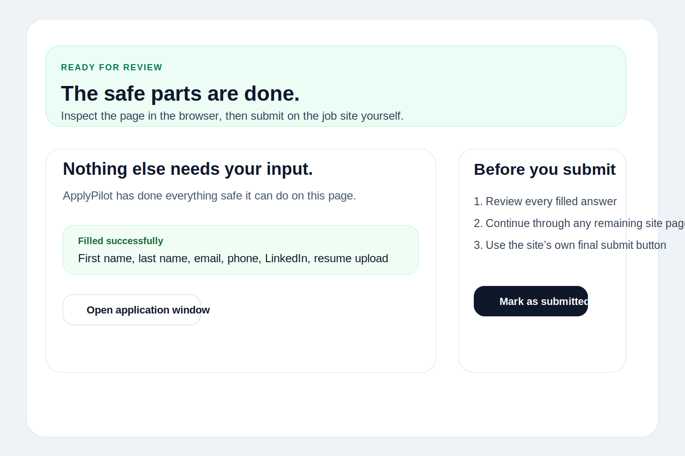

# ApplyPilot

ApplyPilot is a local-first, human-in-the-loop job application assistant that fills known information, drafts grounded answers, and leaves final review and submission to the user.

## Current status

ApplyPilot is a private alpha under active development.

- It is meant for careful, attended use on real application forms.
- It is not designed for unattended or mass application submission.
- It should be treated as an early tester build, not a production service.

## What it does

- Opens supported job application flows in a Playwright-driven application window.
- Uses a reusable local applicant profile for structured autofill.
- Handles common text fields, dropdowns, radio groups, checkboxes, autocomplete controls, and resume uploads.
- Detects visible form fields and maps them to known profile facts.
- Drafts grounded short answers when enough saved evidence exists.
- Surfaces uncertain, sensitive, or unsupported questions for review.
- Tracks application sessions locally.
- Runs a compact readiness check before starting a new application.
- Lets you report incorrect answers locally and optionally reuse approved corrections safely.
- Exports a sanitized local dogfood report for private-alpha testing.
- Preserves manual final review and manual submission.

## Safety model

- ApplyPilot never automatically submits job applications.
- ApplyPilot never bypasses CAPTCHA or other human-verification steps.
- ApplyPilot does not fabricate experience, education, work authorization, salary history, or legal attestations.
- Sensitive or legally meaningful questions are left for user review unless an exact saved answer is available and permitted.
- The browser page is treated as untrusted content.
- Users are expected to inspect every application in the browser before submitting it themselves.

More detail lives in [docs/safety-model.md](docs/safety-model.md).

## Screenshots

The repository includes sanitized UI placeholders under `docs/images/`.

### Initial Apply state



### Active progress state



### Needs-input state



### Ready-for-review state



## Technology

- TypeScript
- Next.js App Router
- React 19
- Tailwind CSS
- Playwright
- Local JSON storage

## Getting started

### Prerequisites

- Node.js 22 or newer
- npm 10 or newer
- Playwright Chromium installed locally

### Installation

```bash
npm install
npx playwright install chromium
```

### Environment setup

Copy or review [.env.example](.env.example).

- No environment variables are required for the default local workflow.
- `APPLYPILOT_SHORT_ANSWER_PROVIDER` is optional and currently only supports the built-in deterministic path.
- Leaving the variable blank uses the built-in grounded short-answer generator.

### Development

```bash
npm run dev
```

Open [http://localhost:3000](http://localhost:3000).

### Validation

```bash
npm test
npx tsc --noEmit
npm run build
```

## Usage

1. Complete the local profile in `Profile`.
2. Upload the resume you want ApplyPilot to use.
3. Paste a job application URL into `Apply`.
4. Let ApplyPilot read the page and fill only the safe basics.
5. Review questions that still need input.
6. Inspect the live application in the browser window.
7. Submit manually on the job site when you decide the application is ready.
8. Record wrong-answer corrections when ApplyPilot fills something incorrectly.

## Testing

- Unit and integration tests:

  ```bash
  npm test
  ```

- Type checking:

  ```bash
  npx tsc --noEmit
  ```

- Production build:

  ```bash
  npm run build
  ```

- Live benchmark:

  ```bash
  npm run benchmark:applications
  ```

- One-session Workday diagnostics:

  Start the app with `npm run dev`, open the target Workday application session in ApplyPilot, then use `More actions` -> `Enable Workday diagnostics` before the next live autofill pass. Sanitized structural traces are written locally under `debug/workday-diagnostics/` and are ignored by Git.

Notes:

- The live benchmark uses public job application URLs that may expire or change without notice.
- Benchmark output is intentionally kept local and ignored from Git.
- A sanitized benchmark summary is documented in [docs/benchmark.md](docs/benchmark.md).
- The private-alpha manual checklist lives in [docs/private-alpha-checklist.md](docs/private-alpha-checklist.md).

## Project structure

- [`app/`](app) contains the Next.js routes and API handlers.
- [`components/`](components) contains the UI shell, forms, and session-review components.
- [`lib/`](lib) contains storage, mapping, autofill, safety, and Playwright orchestration logic.
- [`types/`](types) contains shared TypeScript types.
- [`scripts/`](scripts) contains local benchmark and smoke-test utilities.
- [`tests/`](tests) contains unit and browser-backed tests.
- [`docs/`](docs) contains repository-facing documentation and sanitized UI assets.

## Privacy

ApplyPilot stores runtime data on the local machine in the `data/` directory created at runtime.

That local state can include:

- applicant profile data
- saved answers
- application session history
- uploaded resume files

Debug artifacts and benchmark output are written locally under `debug/` when those workflows are run.

This repository does not claim encryption at rest, secure sync, or isolation from other local processes. Treat the app as a local developer tool and protect the machine accordingly.

## Current limitations

- ATS behavior varies significantly across real application sites.
- Greenhouse, Lever, Ashby, Workable, and simpler HTML forms are the strongest current targets.
- Workday and other multi-step enterprise flows remain partial or heuristic-heavy.
- Login barriers, expired postings, and anti-automation friction can block autofill progress.
- Generated short answers still require human review.
- Final submit actions are always manual.
- Dogfood reporting is local-first and intentionally redacted by default.

## Roadmap

- Improve ATS-specific reliability for more multi-step flows.
- Expand grounded-answer coverage without weakening safety rules.
- Strengthen local diagnostics and benchmark reporting for private-alpha testing.

## Repository notes

- Local runtime state, resumes, sessions, traces, and debug artifacts are intentionally ignored from Git.
- No license is included in this repository yet.
- Contribution guidance lives in [CONTRIBUTING.md](CONTRIBUTING.md).
